# Dreaming transcript-to-skill lifecycle

## Purpose and scope

This document explains how Dreaming turns retained agent sessions into review
evidence, candidate procedures, active skills, usage records, retirement
decisions, and recoverable archives.

The implementation authority for this map is repository revision `1a10787`.
Production code paths are labeled **live**. States and transitions that exist
in the conservative lifecycle policy but are not yet connected to production
mutation are labeled **policy-defined**. This distinction matters because the
installed system can collect autonomous create proposals as shadow candidates,
but it cannot yet promote those candidates into active skills.

The map covers:

- Copilot, Claude, and Codex session discovery;
- completion checks, queueing, bounded snapshots, review, and recovery;
- routing to instructions, memories, skills, support files, or discard;
- evidence envelopes and shadow candidate recurrence;
- candidate evaluation and publication policy;
- active skill loading and usage evidence;
- stale, quarantine, absorption, archive, tombstone, and restore behavior.

It excludes dashboard formatting, test fixtures, and provider authentication
details that do not change lifecycle authority.

## The simple mental model

Dreaming has five different kinds of things. They are related, but they are not
synonyms:

| Term | Plain meaning | What it is not |
| --- | --- | --- |
| Transcript | A retained record of one agent session | Proof that a reusable skill is needed |
| Review | One bounded analysis of one exact transcript revision | A human approval, an evaluation, or proof that a skill works |
| Evidence | Specific transcript events retained to support one finding | A recommendation repeated several times |
| Shadow candidate | A proposed skill package stored outside active skill roots while recurrence is checked | An active skill that agents can load |
| Evaluation | A controlled comparison of behavior with and without an exact candidate | Transcript evidence or recent usage |

A review can end with no reusable procedure. If it does find one, Dreaming
retains the exact supporting events as evidence. One autonomous create proposal
becomes a shadow candidate because a single session is not enough authority to
publish a new skill. The candidate can advance only after independently
verified recurrence and controlled evaluations. “Shadow” therefore means
**stored and measured, but unavailable to agents**, not “a skill that exists
but is mysteriously ignored.”

## Status legend

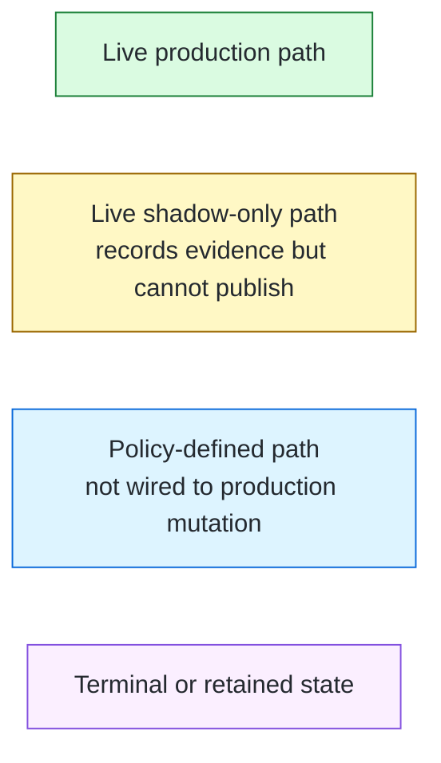

## Complete system boundary map

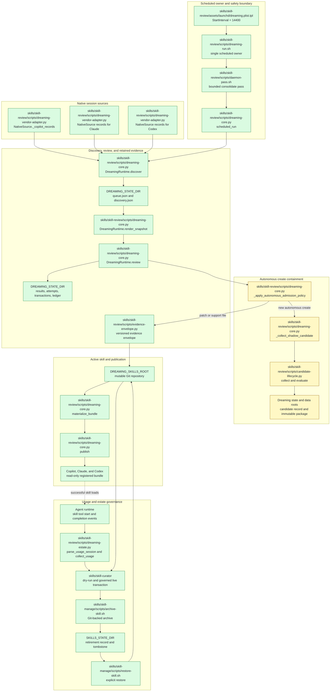

## 1. Scheduling and run admission

The Mac mini owns one scheduled Dreaming job. launchd makes the next start
eligible 14,400 seconds after the previous process exits. A long run therefore
pushes the next start later; this is not six starts pinned to wall-clock times.
The scheduler does not create one worker per source or per session. One process
owns consolidation, optional weekly work, and the handoff to estate curation.

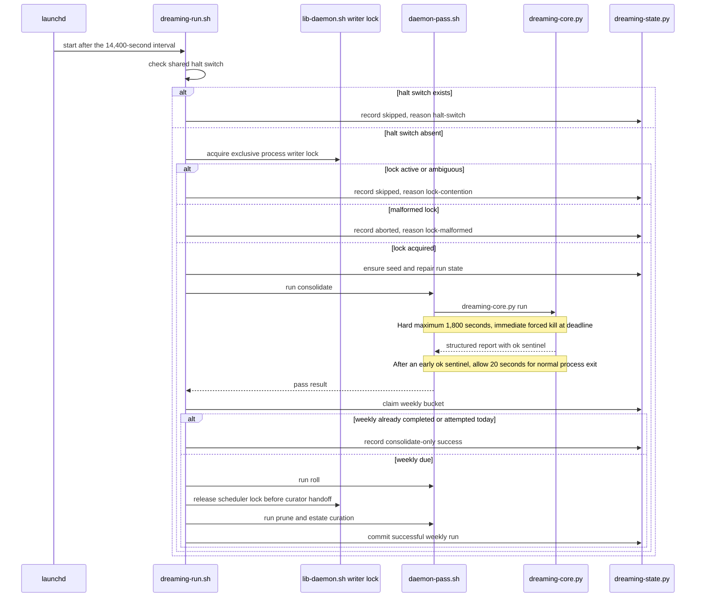

### Scheduling gates and values

| Gate | Value | Effect |
| --- | ---: | --- |
| Launch interval | 14,400 seconds after process exit | Long runs shift later starts; no wall-clock pinning |
| Whole pass limit | 1,800 seconds | At the hard deadline, the owned process group is killed immediately |
| Successful-output settling window | 20 seconds | After the success marker appears early, allow normal process exit before cleanup |
| Review attempts per pass | 25 maximum | Later queued rows remain deferred |
| Weekly work | Once per local day when due | A failed weekly attempt is not retried every four hours |
| Shared halt switch | Must be absent | Stops scheduled review and live curation |
| Writer lock | Must be valid and acquired | Prevents overlapping mutation |

## 2. Raw transcript discovery and completion admission

Each source adapter converts its native session format into the same identity
and event contracts. Native IDs remain opaque and are qualified with their
source, such as `copilot:<id>`.

The adapter reports session features, but the live multi-CLI core currently
does not use those features to screen or prioritize the queue. It queues every
non-daemon session that is terminal or quiet.

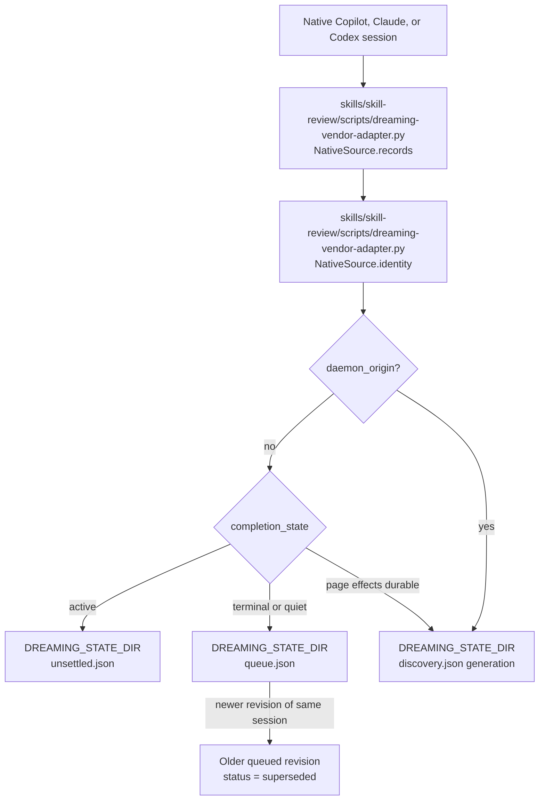

Discovery uses a fixed scan generation:

1. Capture the source high watermark as the generation ceiling.
2. Start from the prior settled watermark minus a 300-second overlap.
3. Read stable pages of 100 sessions.
4. Process at most 100 pages per scheduled run.
5. Persist queue and unsettled changes before advancing the cursor.
6. Move the settled watermark only after the fixed generation is exhausted.

The fixed ceiling prevents new sessions from continually moving the end of the
scan. The overlap recovers timestamp ties, clock skew, and interrupted writes.

### Completion states

| State | Queue behavior |
| --- | --- |
| `active` | Retained in the unsettled index and checked again after 300 seconds |
| `terminal` | Eligible for the review queue |
| `quiet` | Eligible when unchanged for the source adapter's configured quiet period |
| Missing on recheck | Removed from the unsettled index as deleted |
| Unsupported or malformed | Reported as a source error; never converted to empty success |

## 3. Immutable review evidence

The review executor never reads the native source store directly. Dreaming
first creates a bounded, immutable snapshot.

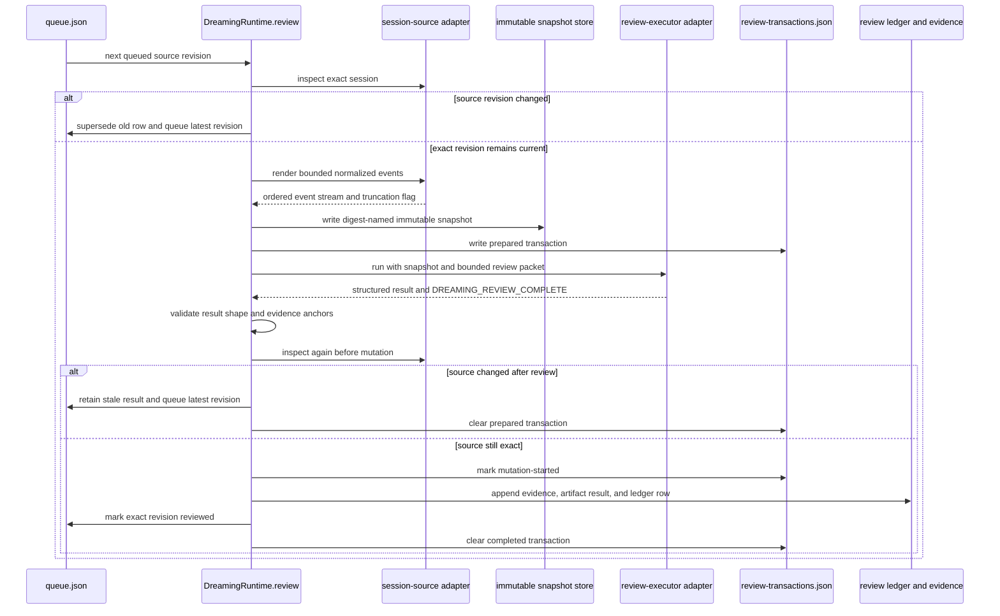

### Snapshot and result limits

| Boundary | Value |
| --- | ---: |
| Maximum normalized events | 2,000 |
| Maximum snapshot JSON | 100,000 bytes |
| Maximum text, tool-name, or source-event field | 64,000 bytes |
| Evidence anchors for an artifact | 1 to 20 unique event IDs |
| Summary or routing reason | 4,000 bytes each |
| Skill Markdown | 256,000 bytes |
| Each support file | 256,000 bytes |

Truncation is explicit. A changed digest, frontier, completion state, or
adapter version makes the result stale and blocks mutation.

## 4. Review routing

The review executor must choose one terminal route.

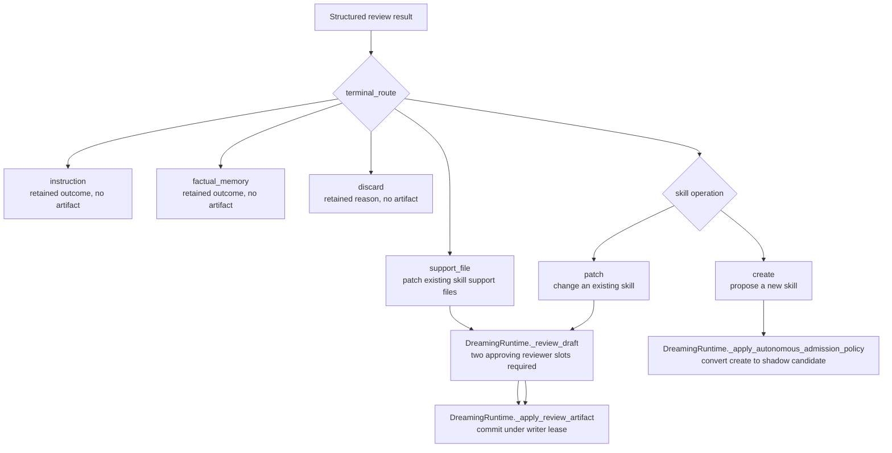

The live containment rule is:

- autonomous `create` is not allowed to write a new active skill;
- it is converted to a retained `discard` result with
  `policy_deferred.reason = autonomous-create-requires-recurrence`;
- its proposed package is copied into isolated candidate storage;
- existing skill patches and support-file additions may still proceed after
  two approving draft reviews;
- sources older than 30 days cannot mutate an artifact.

This means "discard" can represent a preserved deferred create proposal, not
only a finding with no reusable value.

## 5. Shadow candidate recurrence

The first autonomous create proposal creates a stable lifecycle record and an
immutable candidate package outside every live skill root.

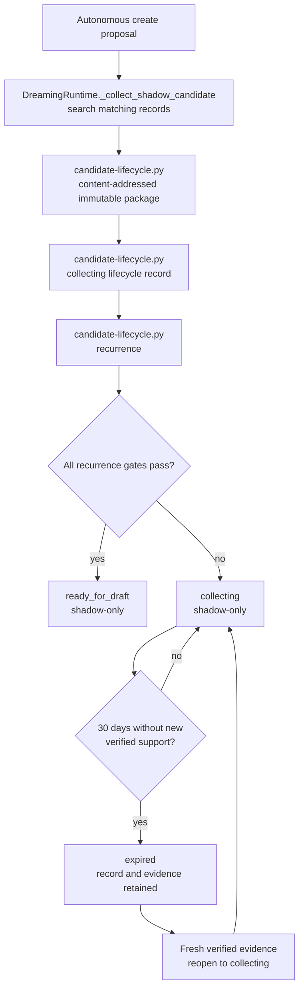

### Recurrence gates

A candidate becomes `ready_for_draft` only when every gate passes:

1. At least two evidence entries are marked `independence: verified`.
2. They contain at least two distinct opaque task keys.
3. They come from at least two distinct source sessions.
4. At least one verified observation is no more than 30 days old.
5. The oldest and newest verified observations are no more than 45 days apart.
6. The match is not uncertain.
7. No covering active lifecycle record blocks the candidate.
8. No tombstone blocks the candidate.

Repeated mentions inside one task do not increase recurrence strength.

### Current shadow limitation

The automatic collector currently creates a task key from the source session
and records `independence: unverified`. No production path in
`dreaming-core.py` upgrades that observation to verified independence.
`candidate-lifecycle.py` can evaluate verified observations, and its tests
exercise them, but scheduled autonomous collection alone cannot currently
cross the recurrence gate.

The implemented shadow states are:

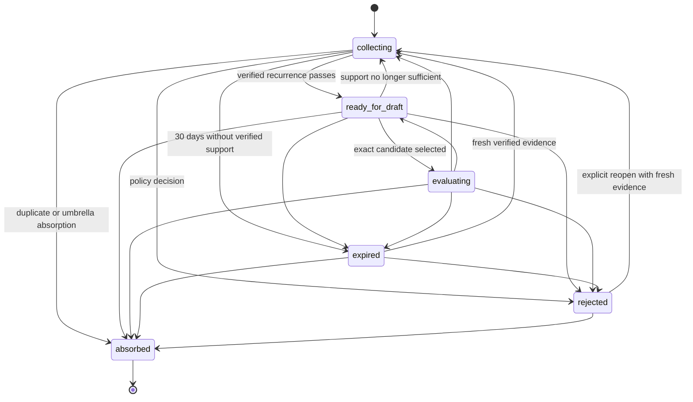

## 6. Candidate evaluation and admission policy

The following path is defined by the conservative lifecycle design. It is not
yet connected to production candidate publication.

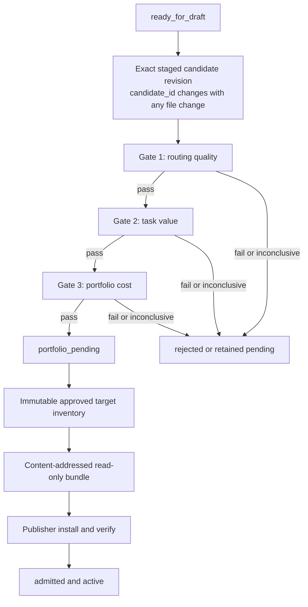

No combined score can hide a failed gate.

### Evaluation treatments

| Treatment | Loaded skills |
| --- | --- |
| `zero` | No non-built-in skills |
| `production` | Current approved bundle |
| `proposed` | Production bundle plus exact candidate batch |
| `candidate_only` | Exact candidate alone, diagnostic only |

Candidate and control arms use the same CLI, exact model, task input, starting
state, tool policy, timeout, context profile, graders, and trial number.

### Default trial gates

For every required executor:

- each intended candidate arm passes at least two of three trials;
- capability uplift improves by at least one successful trial and cannot pass
  when control already succeeds in all three;
- preference conformance passes at least two of three trials and wins at least
  two of three blind comparisons;
- related cases preserve every deterministic invariant, perform at least as
  well as control, and add no forbidden action;
- activation-positive prompts load the skill in at least two of three trials;
- activation-negative prompts load it in zero of three trials;
- missing traces, mismatched models or budgets, unproved loads, invalid
  graders, and infrastructure failures produce `inconclusive`, never pass.

### Evaluation currency

| Evidence | Default currency |
| --- | --- |
| Staged candidate routing and task value | 30 days |
| Admitted skill task-value receipt | Immutable admission evidence; recertification due within 90 days |
| Zero-skill anchor on immutable model | 90 days |
| Zero-skill anchor on moving or partially visible model | 30 days |
| Production and proposed portfolio result | Current weekly bucket |
| Trusted model proxy calibration | Maximum 90 days and invalidated by bound identity changes |

Any candidate, suite, policy, model, CLI, adapter, harness, grader, tool,
context profile, fixture, or known instruction change invalidates dependent
candidate evidence.

## 7. Publication and activation

An active skill lives in the one mutable Git repository at
`DREAMING_SKILLS_ROOT`. Publisher adapters expose a read-only,
content-addressed bundle to selected CLIs.

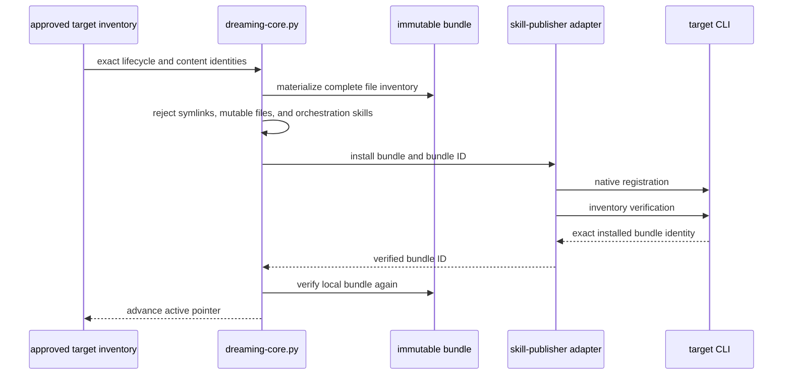

If installation or verification fails, the prior active inventory remains
authoritative. Publication failure does not erase a valid local skill commit.

## 8. Skill use and activity evidence

A catalog entry or file read does not count as use. Dreaming counts only a
proved successful skill-tool invocation.

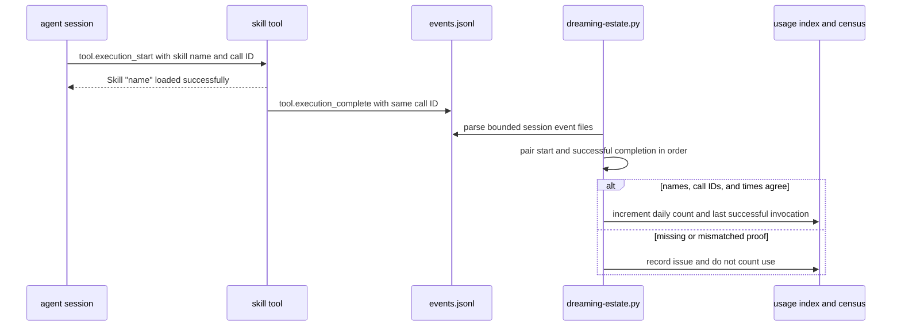

The usage collector waits 300 seconds for a session file to become quiet. Its
default bounded scan is 10,000 session directories or 1 GiB of event data.
Incomplete or conflicting mappings make usage partial or unknown.

Activity may also be refreshed by:

- new verified independent task evidence;
- a passing candidate-specific reevaluation;
- a current portfolio benchmark proving retained value;
- explicit user adoption.

Dashboard views, publication, evaluation setup, and catalog listing do not
refresh the activity clock.

## 9. Stale, abandoned, quarantine, and archive paths

There are two related lifecycle policies.

### Legacy and personal skill curation

| Condition | State or action |
| --- | --- |
| Used within 30 days or newly created | Active |
| No use for 30 to 89 days | Stale and visible for review |
| No use for at least 90 days | Archive-eligible only when telemetry is complete |
| Completed bounded project, no reuse value, no umbrella target | May be proposed after 14 days since creation and last use |
| Pinned or scheduled dependency | Archive blocked |
| Hand-made, plugin-owned, or unknown provenance | Recommendation only |

### Dreaming-managed admitted lifecycle policy

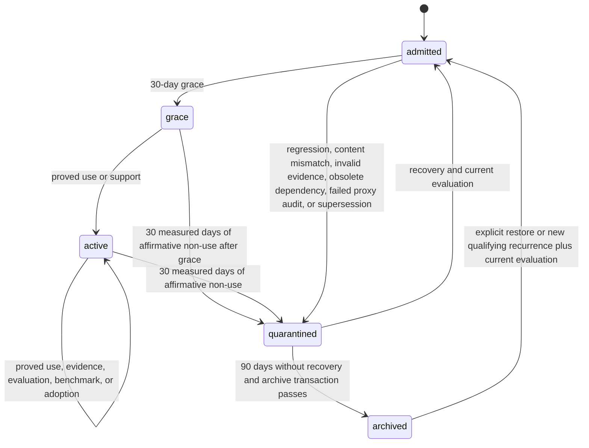

Unknown or partial usage cannot start an age-only quarantine or archive clock.
It can place the skill on a review shortlist, but it cannot authorize removal.

A candidate that never becomes an active skill is not deleted:

- `collecting` expires after 30 days without fresh verified support;
- `rejected` retains its evidence and exact candidate history;
- `absorbed` keeps its aliases and evidence under the surviving lifecycle;
- a tombstone prevents an archived procedure from being recreated
  autonomously under the same covered identity.

## 10. Archive, tombstone, and restore

Archive uses Git history instead of moving dead skills into a shipped archive
directory.

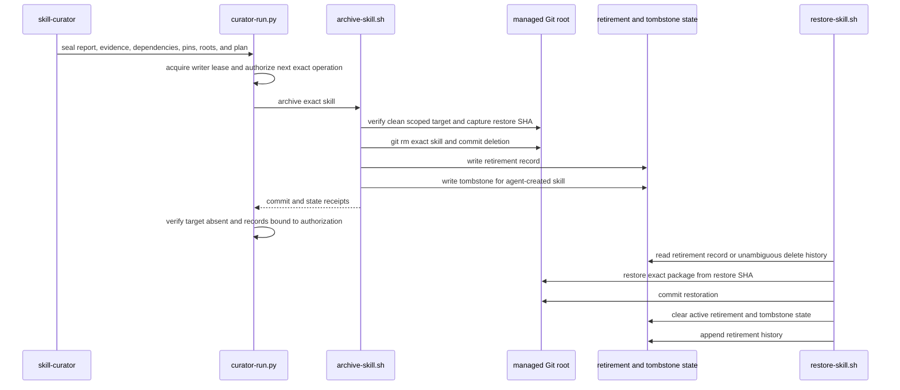

Archive refuses:

- pinned skills;
- ambiguous roots or identities;
- unrelated dirty work;
- missing dependency inventory;
- stale or changed curator reports;
- missing evaluation for an absorption destination;
- a halt or pause that appears before mutation;
- hand-made or plugin-owned targets in autonomous mode.

Restore is explicit. It does not silently reset evidence age or evaluation
currency. A restored skill must regain any certification required for active
publication.

## 11. Entry and exit table

| Boundary | Entry | Owned processing | Observable exit |
| --- | --- | --- | --- |
| macOS schedule | `dreaming-run.sh` | Halt, lock, consolidate, weekly claim, curator handoff | Retained run record with pass status |
| Native session source | `NativeSource.records` and adapter `list` | Identity, completion state, bounded features | Queued, unsettled, skipped daemon, or source error |
| Review queue | `DreamingRuntime.review` | Snapshot, executor selection, stale checks, transaction journal | Reviewed, deferred, stale, deleted, failed-before-mutation, or recovery-required |
| Review result | `_validated_review_result` | Route and artifact validation | Instruction, memory, skill, support file, or discard |
| New autonomous skill | `_apply_autonomous_admission_policy` | Shadow containment and recurrence record | Collecting or ready shadow candidate; no active skill |
| Existing skill patch | `_review_draft` then `_apply_review_artifact` | Two draft reviews, evidence envelope, scoped Git commit | Updated active local skill |
| Candidate policy | Lifecycle and evaluation policy | Routing, value, portfolio, publication gates | Admitted, pending, rejected, quarantined, absorbed, or archived |
| Skill invocation | `parse_usage_session` | Pair exact tool start and successful completion | Counted use or explicit usage issue |
| Curator | dry-run then governed live transaction | Pins, dependencies, evaluation, provenance, usage, recovery | Keep, consolidate, archive, or recommendation only |
| Archive | `archive-skill.sh` | Scoped Git deletion and retirement state | Recoverably absent skill plus tombstone |
| Restore | `restore-skill.sh` | Exact Git history restoration | Live package plus retained lifecycle history |

## 12. Current weaknesses and scaling limits

### The queue ignores its own scoring features

The source adapter already computes tool calls, distinct tools, correction
signals, skill-intent signals, and daemon origin. The live core uses only
daemon origin. It queues every completed session instead of applying the
shared scoring and eligibility policy described by the design.

The older deterministic screen requires at least one of:

- five tool calls;
- one correction signal;
- one explicit skill-intent signal.

It then scores:

```text
min(tool_calls, 30)
+ 2 * min(distinct_tools, 8)
+ 5 * correction_signals
+ 4 * skill_intent_signals
```

A read-only measurement of the installed queue found:

| Queue group | Sessions |
| --- | ---: |
| Current queued total | 1,401 |
| Pass the existing deterministic eligibility screen | 791 |
| Fail that screen | 610 |
| Score at least 10 | 733 |
| Score at least 20 | 442 |
| Score at least 30 | 268 |

Applying an evidence-preserving screen before expensive model review would
reduce the visible model-review backlog by 43.5 percent without raising the
25-attempt model limit. Low-scoring rows should be marked as deterministically
screened with their features and policy identity, not deleted.

### The candidate admission bridge is incomplete

Autonomous create proposals are correctly prevented from publishing after one
session, but the installed collector marks their task independence as
unverified and has no production path to establish verified independence.
The shadow registry can therefore accumulate candidates that scheduled
Dreaming cannot advance.

The missing bridge must establish opaque independent task identity without
deriving it from transcript text, then feed verified observations into the
existing recurrence evaluator.

### The production lifecycle is designed but not connected

The record schema names `portfolio_pending`, `admitted`, `quarantined`, and
`archived`, but the shadow lifecycle helper rejects production transitions.
Active skill publication and retirement exist through older managed-skill and
curator paths rather than one end-to-end lifecycle record.

Connecting these paths requires transactionally binding:

- exact lifecycle and candidate revision;
- required evaluation receipts;
- approved target inventory;
- publication result;
- usage and dependency evidence;
- quarantine, archive, and restore receipts.

### Fixed capacity has a hard ceiling

The installed schedule permits at most 150 review attempts per day. Stale,
deleted, or already-reviewed rows currently consume attempt slots because the
counter advances before `DreamingRuntime.review` determines their terminal
result.

A stronger bounded design would use two limits:

- a larger deterministic queue-scan limit;
- the existing 25 limit only for reviews that actually launch an executor.

That preserves the model-cost boundary while preventing cheap stale checks
from consuming expensive review capacity.

### Usage completeness is intentionally conservative

Missing target telemetry blocks age-only retirement. This prevents unsafe
deletion but can retain abandoned skills indefinitely when one CLI cannot
prove loads. Improving this requires complete native load telemetry or an
explicit user decision, not treating missing data as zero.

## Ownership summary

- Source adapters own native parsing, completion signals, normalized events,
  and feature extraction.
- `dreaming-core.py` owns discovery generations, queue state, immutable
  snapshots, executor routing, result validation, transaction recovery, and
  content-addressed publication.
- Review executors propose routes and artifacts. They do not own mutation
  authority.
- `candidate-lifecycle.py` owns shadow candidate identity, recurrence records,
  legal shadow transitions, and immutable candidate packages.
- The conservative lifecycle policy defines production admission,
  certification, quarantine, and archive gates that are not fully wired.
- `dreaming-estate.py` owns verified usage collection and estate census.
- `skill-curator` owns governed keep, consolidation, and retirement decisions.
- `archive-skill.sh` and `restore-skill.sh` own recoverable Git-backed
  decommissioning.
- The dashboard presents retained state. It never authorizes mutation.
